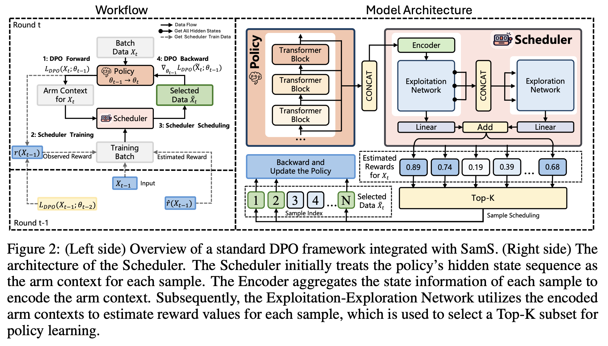

# Adaptive Sample Scheduling for Direct Preference Optimization (SamS)
Code for NeurIPS 2025 paper "Adaptive Sample Scheduling for Direct Preference Optimization".

---
The effectiveness of offline Direct Preference Optimization (DPO) relies on the quality of preference sample pairs. However, existing offline preference datasets often contain noise, and the same set of samples presents varying learning difficulties for models at different states. 

Thus, there exists a high-quality subset and a sample scheduling order that outperform randomly shuffled full dataset training. Our approach is to dynamically identify, in each DPO training round, the most beneficial samples for the model based on the policy model's feedback, using them as a high-quality subset for training.

We model this sample selection as a multi-armed bandit problem and employ an exploration-exploitation network-based scheduler during training: 
**1. estimate reward distribution (score each sample) 
2. select high-reward arms (choose high-scoring samples as the subset)
3. observe rewards of selected arms and update the reward distribution estimate (update the scheduler)**

---

The files in this repo are:

- `train_raw_dist.py`: the main entry point for training (either SFT or DPO preference-based training)
- `scheduler.py`: the definition and implementation of the scheduler
- `trainers_dist.py`: the trainer classes (e.g., implementing the loop of learning as well as multi-GPU logic)
- `utils.py`: some convenience functions used by multiple other files
- `preference_datasets.py`: dataset processing logic for both SFT and DPO preference-based training; **this is where you'll need to make some additions to train on your own data**.

The definition and implementation of the scheduler are located in `scheduler.py`, while the implementation of the workflow is found in the `Trainer.train()`  within `trainers_dist.py`.

 You can find all configuration information in the `./config` directory, including loss parameters, scheduler parameters, model parameters, as well as training and evaluation parameters.

## Tips for Running SamS

Given the various inquiries about SamS, we provide a list of tips to help you reproduce our paper results and achieve better outcomes for running SamS on your own tasks. 

### Environment

We provide  ``requirements.txt``  including the python package versions we used in our experiments. For optimal reproducibility, we recommend using the same package versions. However, please note that results may still vary due to differences in hardware configurations and CUDA versions, etc.

### Hyperparameter tuning

For DPO, the best hyperparameters for each setting are as follows.

| Setting              | β    | Learning Rate |
| -------------------- | ---- | ------------- |
| Mistral-Instruct     | 0.01 | 5e-7          |
| Llama3-Instruct      | 0.01 | 1e-6          |
| Llama3-Instruct v0.2 | 0.01 | 1e-6          |
| Gemma v0.2           | 0.01 | 5e-7          |

### Reproducing AlpacaEval 2 numbers

Please make sure that you use `alpaca-eval==0.6.2`  for successfully reproducing AlpacaEval 2 results. AlpacaEval has a major revision for vllm decoding since `0.6.3` and causes a discrepancy from our experiments. 

## Evaluation

We follow the official implementation for evaluation on AlpacaEval 2 and MT-Bench, as follows :

* AlpacaEval 2: Please refer to the [AlpacaEval repo](https://github.com/tatsu-lab/alpaca_eval) for evaluation.
* MT-Bench: Please refer to the [FastChat repo](https://github.com/lm-sys/FastChat) for evaluation.

## Install Requirements

We provide  `requirements.txt`   which contains package dependencies. 

    conda create -n sams python=3.10 
    conda activate sams
    pip install -r requirements.txt

## Training Scripts

The training config is set for 8xA100 GPUs. For specific  tutorial for running the code, please refer to the Direct Preference Optimization (DPO) codebase https://github.com/eric-mitchell/direct-preference-optimization.

**Run SFT:**

    sh run_sft.sh 

**Run Scheduler Pretrain:**

    sh run_scheduler_pretrain.sh 

**Run DPO:**

    sh run_dpo.sh 

## Citation
If you find SamS or code useful, please cite

    @article{huang2025adaptive,
      title={Adaptive Sample Scheduling for Direct Preference Optimization},
      author={Huang, Zixuan and Ban, Yikun and Fu, Lean and Li, Xiaojie and Dai, Zhongxiang and Li, Jianxin and Wang, Deqing},
      journal={arXiv preprint arXiv:2506.17252},
      year={2025}
    }